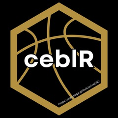

<!-- README.md is generated from README.Rmd. Please edit that file -->

```{r, include = FALSE}
knitr::opts_chunk$set(
  collapse = TRUE,
  comment = "#>",
  fig.path = "man/figures/README-",
  out.width = "100%"
)
```

# ceblR <a href="https://awosoga.github.io/ceblR/"></a>

<!-- badges: start -->
[](https://github.com/awosoga/ceblR/actions/workflows/R-CMD-check.yaml)
[](https://github.com/awosoga/ceblR) 
[](https://lifecycle.r-lib.org/articles/stages.html#experimental)
[](https://app.codecov.io/gh/awosoga/ceblR?branch=master)
<!-- badges: end -->

The goal of this package is to help people access clean and tidy data from the 
[Canadian Elite Basketball League](https://cebl.ca). It provides functions to present data in an 
easy-to-use format that provides greater detail and accessibility than official league sources.

## Installation

You can install the development version of [**`ceblR`**](https://github.com/awosoga/ceblR) 
from [GitHub](https://github.com/awosoga/ceblR) with:

``` r
# install.packages("devtools")
devtools::install_github("awosoga/ceblR")
```

## Usage

Please refer to the [package vignette](https://awosoga.github.io/ceblR/articles/ceblR-how-to-use.html) for more information on how to use this library.

### Acknowledgement

This package takes heavy inspiration from [Jason Zivkovic's](https://twitter.com/jaseziv)
[**`euroleagueR`**](https://github.com/JaseZiv/euroleagueR/) package.
Please give his package a star!

